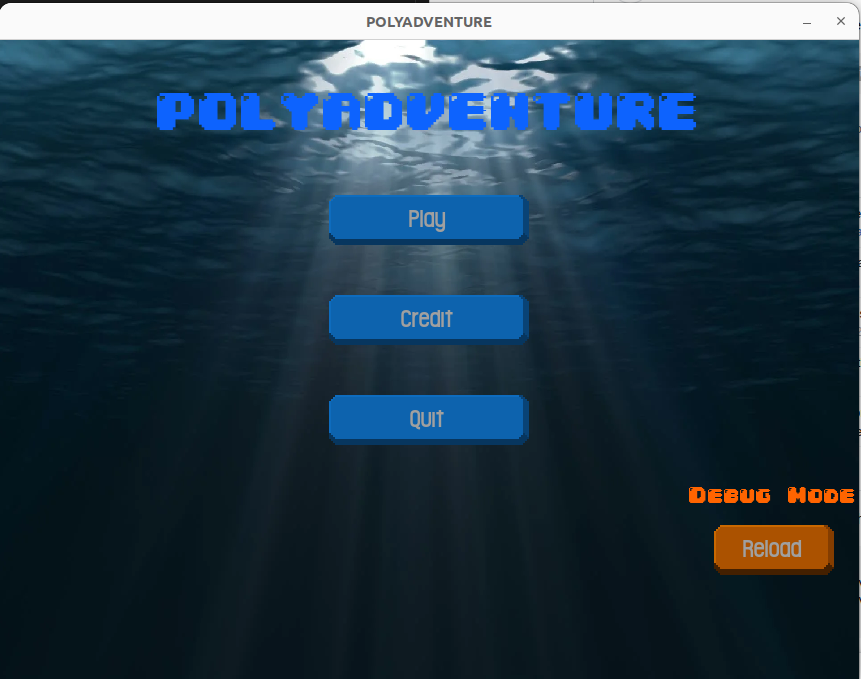
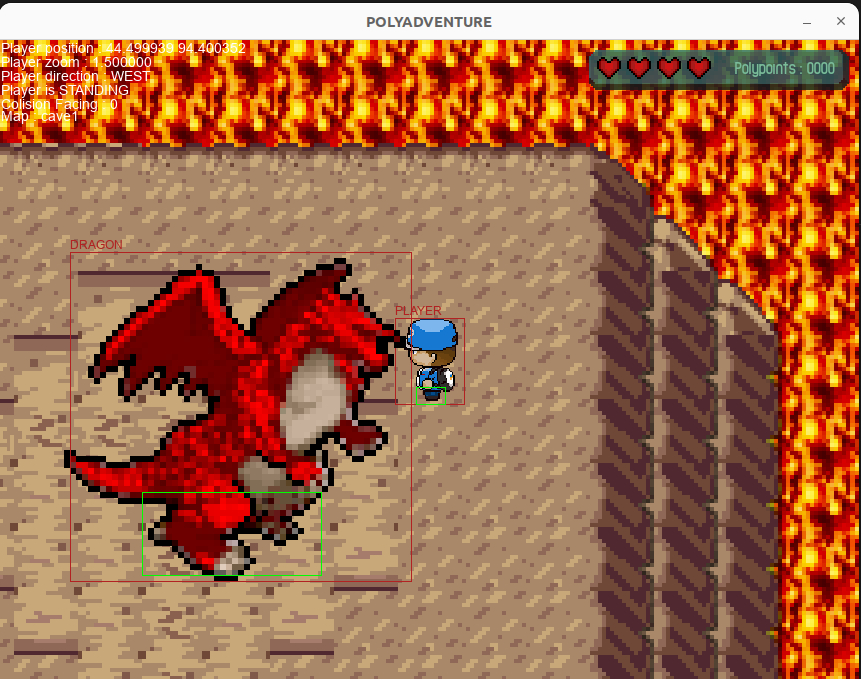
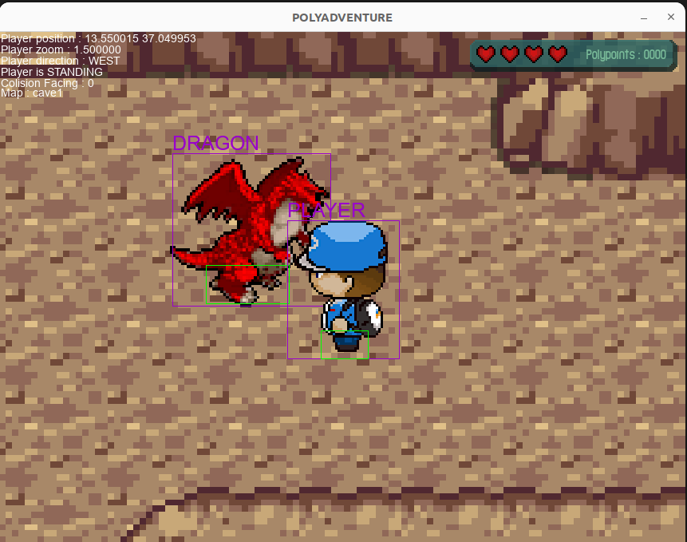
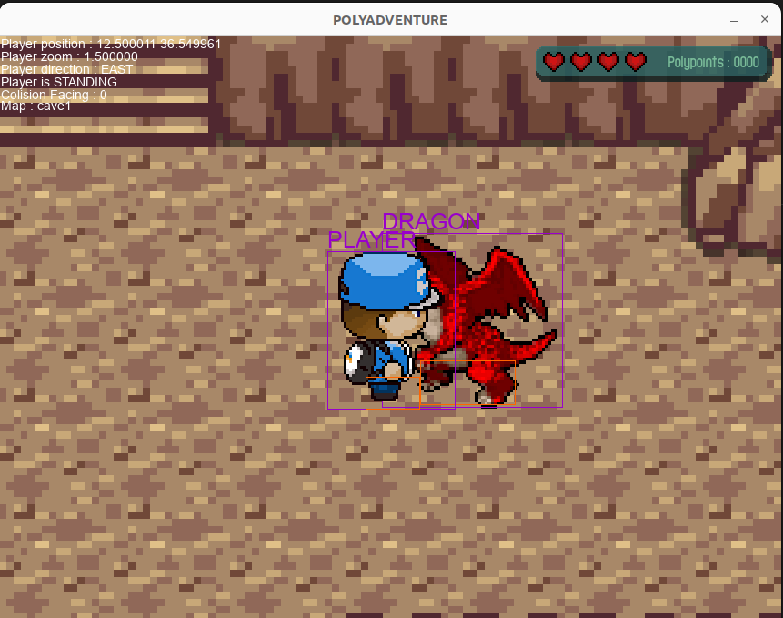

# PolyAdvanture Game

## General Info

This project was developed for the school purpose of developing a video game in one month.

We chose to develop a 2D action-adventure game. Our idea was to create an environment in which the character can interact with several entities such as watches or NPCs.

The game uses tile sets for the graphics of the world and entities.

To facilitate the creation of new worlds and entities, configuration files allow simple and dynamic modification of the game, without the need to recompile it. The configuration files, recognizable by their '.conf' extension, use a syntax that we have developed especially for the game. This syntax allows you to indicate the type of each variable, to construct tables and to define variables from their digital identifier.

A debugger mode is available and can be activated on the command line by entering './PolyAdvanture -debug' in the terminal.

The interaction between entities uses a rudimentary system. Each entity has two collision boxes, one to define the size of its body and one to define the part of its body in contact with the ground. Each entity is stored in the same list. At each frame, the entities are updated, which allows them to be moved automatically and displayed one according to the other to give an interesting perspective if the collision boxes of two entities overlap.

This interaction is visible in the screenshots below between the player and a dragon.

## Technologies

The programs use the SDL2 library for sound and graphics.

This project was developed under Linux with the vscode editor.

The code was completed with version gcc 11.4.0.

## Captures

